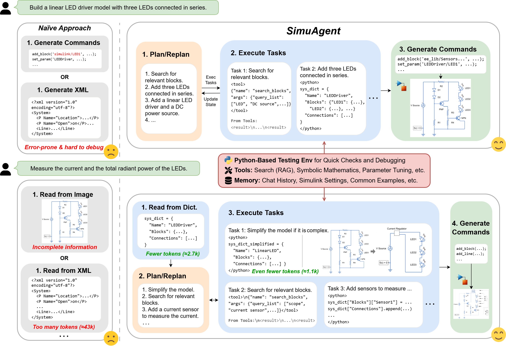
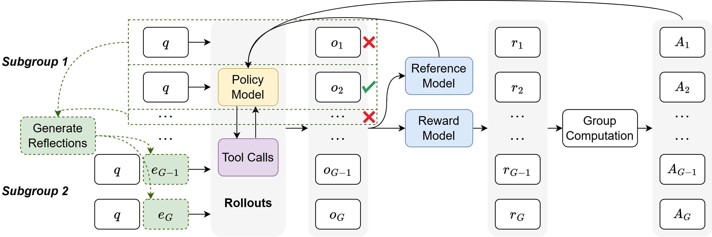

# SimuAgent: An LLM-based Simulink Modeling Assistant

[](https://www.python.org/downloads/)
[](https://www.gnu.org/licenses/agpl-3.0)

SimuAgent is an LLM-powered modeling and simulation agent designed for Simulink. This repository contains the code and resources related to the SimuAgent framework, with a focus on its training mechanisms and tool integration.

## 🌟 Key Features

* **Lightweight Python Representation:** Simulink models are represented as Python dictionaries, making them more amenable to LLM processing and manipulation.
* **Plan-Execute Architecture:** SimuAgent employs a lightweight plan-execute paradigm for task decomposition and execution.
* **Reflection-GRPO (ReGRPO):** A novel reinforcement learning algorithm that augments Group Relative Policy Optimization (GRPO) with self-reflection traces. This provides richer intermediate feedback, accelerating convergence and improving robustness, especially in tasks requiring tool use.
* **Tool Integration:** The framework is designed to allow the LLM to leverage external tools for tasks like block searching and model analysis.
* **Comprehensive Evaluation:** Multi-faceted reward system for evaluating model quality across connectivity, validation, and electrical parameters.


*Fig1: Comparison between SimuAgent and conventional workflows*


*Fig2: ReGRPO architecture*

## 🚀 Quick Start

### Installation

```bash
# Clone the repository
git clone <repository-url>
cd SimuAgent

# Install dependencies
pip install -r requirements.txt

# Install the package in development mode
pip install -e .
```

### Comparison test between GRPO and ReGRPO

1. **Without tools:**
    ```bash
    python ReGRPO/quick_start.py
    ```

2. **With tool integration:**
    ```bash
    python ReGRPO/quick_start_with_tools.py
    ```

### Training Examples

```bash
# Train execution agent
python examples/train_execution.py

# Train planning agent
python examples/train_planning.py
```

## 📁 Project Structure

```
SimuAgent/
├── ReGRPO/                    # Comparison test between GRPO and ReGRPO
│   ├── envs/                  # Training environments
│   ├── rewards/               # Reward systems
│   ├── tools/                 # Agent tools (Python, search)
│   └── trainers/              # GRPO trainers
├── envs/                      # Environment management system
├── rewards/                   # Comprehensive reward framework
├── system_parser/             # Power system parsing and validation
├── tools/                     # General purpose tools
├── trainers/                  # Training utilities
├── examples/                  # Usage examples
└── docs/                      # Documentation and diagrams
```

## 🔧 Core Components

### Environment System
The `envs/` module provides a robust environment management system for AI agent simulations:

- **Modular Architecture**: Clean separation between environment types and execution logic
- **Multi-Environment Support**: Simultaneous management of different environment types
- **Comprehensive Monitoring**: Built-in logging, metrics, and performance tracking

📖 [**Read the full Environment documentation**](envs/README.md)

### Reward Framework
The `rewards/` module offers a comprehensive, modular reward system:

- **Multi-Domain Support**: Mathematics, code execution, tool usage, and power systems
- **Component-based Evaluation**: Detailed scoring with component breakdown
- **Flexible Configuration**: Customizable weights for different training objectives

📖 [**Read the full Rewards documentation**](rewards/README.md)
📖 [**Power System Rewards Guide**](rewards/README_power_system_rewards.md)

### System Parser
The `system_parser/` module provides power system parsing and validation:

- **Comprehensive Analysis**: Connectivity, electrical parameters, and topology analysis
- **Robust Validation**: Multi-layer validation with detailed error reporting
- **Pandapower Integration**: Seamless conversion to Pandapower format

📖 [**Read the full System Parser documentation**](system_parser/README.md)

### Tools
The `tools/` module includes specialized tools for agent interaction:

- **Plan Tool**: Structured planning and execution capabilities
- **Search Tools**: Block searching and system analysis
- **Python Tool**: Safe code execution environment

📖 [**Plan Tool Documentation**](tools/README_PLAN.md)

## 💡 Usage Examples

### Basic ReGRPO Training

```python
from ReGRPO.trainers import GRPOTrainer
from ReGRPO.envs import ToolReflectionEnv

# Initialize environment
env = ToolReflectionEnv(
    dataset=your_dataset,
    tools=[search_blocks, python],
    max_steps=5
)

# Initialize trainer
trainer = GRPOTrainer(
    model_name="your-model",
    environment=env,
    learning_rate=1e-5
)

# Start training
trainer.train(num_episodes=1000)
```

### Power System Evaluation

```python
from rewards import PowerSystemReward

# Initialize evaluator
evaluator = PowerSystemReward(
    weights={
        'load_satisfaction': 1.0,
        'connectivity': 0.5,
        'validation': 0.3
    }
)

# Evaluate system designs
scores = evaluator.evaluate(completions, init_code)
print(f"System scores: {scores}")
```

### System Parsing and Validation

```python
from system_parser import SystemGraph, GraphBuilder

# Build system from dictionary
builder = GraphBuilder()
system = builder.build_from_dict(system_dict)

# Analyze connectivity
connectivity = system.analyze_connectivity()
print(f"Load satisfaction: {connectivity.connectivity_ratio:.2%}")
```

## 🧪 Development

### Code Quality

```bash
# Format code
black .

# Type checking
mypy .

# Linting
flake8 .
```

## 📊 Performance Metrics

SimuAgent tracks comprehensive metrics during training:

- **Reward Components**: Detailed breakdown of reward sources
- **System Quality**: Connectivity, validation, and physical metrics
- **Training Progress**: Loss curves, convergence rates, and success rates
- **Tool Usage**: Tool execution success and efficiency metrics

## 🔄 Current Status & Future Work

This repository contains the initial implementation of SimuAgent and the ReGRPO algorithm. We are actively working on:

- 🚀 Expanding the toolset for more complex modeling tasks
- 📈 Improving performance on large-scale power system models
- 🔧 Enhanced integration with industry-standard simulation tools
- 📚 Comprehensive benchmarking and evaluation frameworks

## 📄 License

This project is licensed under the GNU Affero General Public License v3.0 (AGPL-3.0). See the [LICENSE](LICENSE) file for details.

The AGPL-3.0 license ensures that any modifications or derivative works must also be made available under the same license terms, including when the software is used to provide network services.

## 🤝 Contributing

We welcome contributions! By contributing to this project, you agree that your contributions will be licensed under the AGPL-3.0 license.

---

*(Note: This project is currently under active development, and some components may be subject to change.)*
